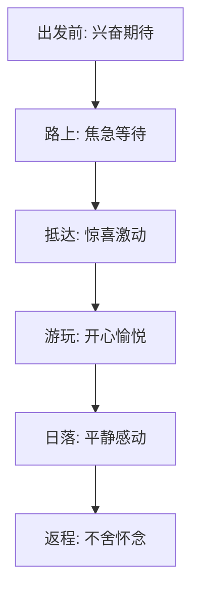

## 🌊 海边的记忆

这是一段关于海边旅行的美好回忆，记录了那些阳光、沙滩和海浪的瞬间。

### 📸 记忆碎片

**阳光**洒在金色的沙滩上，<u>海浪</u>轻轻拍打着岸边，_海风_拂过脸庞，~~烦恼~~随着浪花消散，只有当下的美好值得珍藏^1^。

> 引用："人生就像一场旅行，不必在乎目的地，在乎的是沿途的风景以及看风景的心情。" —— 《人生旅途》

### 📝 旅行日记

1. **出发**：清晨六点，我们带着期待和兴奋出发了
2. **抵达**：中午时分，终于看到了梦寐以求的大海
3. **探索**：沿着海岸线漫步，发现了许多美丽的贝壳
4. **日落**：傍晚时分，欣赏了壮观的海上日落
5. **返程**：带着满满的回忆，踏上了归途

### 🏖️ 海边趣事

- [x] 捡贝壳
- [x] 堆沙堡
- [x] 踩浪花
- [ ] 游泳（因为水温有点低）
- [x] 看日落
- [x] 拍美照

### 🎨 风景如画

### 🌡️ 旅行数据

| 项目 | 数值 | 单位 |
| :--- | :--- | :--- |
| 温度 | 25 | °C |
| 湿度 | 70 | % |
| 风速 | 5 | m/s |
| 海浪高度 | 1.2 | m |

### 📊 心情变化

### 💡 旅行感悟

这次海边旅行让我深刻体会到，生活中的美好往往就藏在那些简单的瞬间里。当我们放下手机，用心去感受周围的一切，就能发现许多被忽略的美丽。

海纳百川，有容乃大。看着一望无际的大海，所有的烦恼都显得那么渺小。人生也应该像大海一样，拥有宽广的胸怀，包容一切。

### 📌 小贴士

!!! tip 保存记忆的小技巧

1. 及时记录：旅行结束后尽快整理照片和文字
2. 分类归档：按照时间、地点或主题对记忆进行分类
3. 定期回顾：每隔一段时间回顾一次，重温美好
4. 分享快乐：将记忆分享给家人和朋友，让快乐加倍

!!!

### 🌟 结语

海边的记忆就像一颗珍珠，被我珍藏在心底。每当想起那些阳光、沙滩和海浪，心中就会涌起一股暖流。

愿我们都能多出去走走，多看看这个世界，多留下一些美好的记忆。因为这些记忆，将是我们人生中最宝贵的财富。

---

*这是一条美好的记忆，值得永远珍藏*